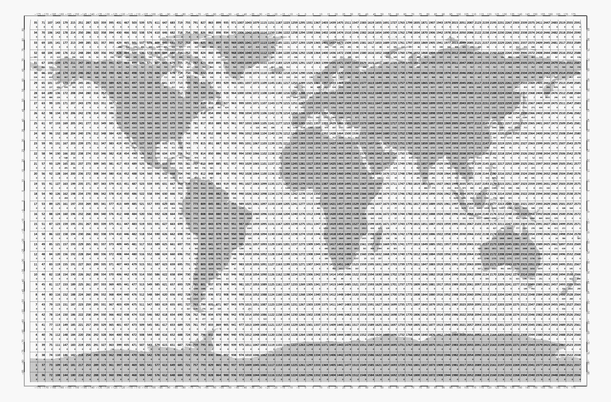

# Conversion to time series format

For a lot of applications it is favorable to convert the image based format into
a format which is optimized for fast time series extraction. This is what we
often need for e.g. validation or climate change studies.
This can be done by stacking the images into netCDF chunks (small data cubes)
with a chunksize of 5x5 degrees, i.e. up to 400 0.25 degree grid
cells per file.

- Reduce amount of stored data by saving only land points by default.
- Follow the standards of the Climate and Forecast convention for
  [Orthogonal multidimensional array representation](https://cfconventions.org/Data/cf-conventions/cf-conventions-1.11/cf-conventions.html#_orthogonal_multidimensional_array_representation>).
- Store the time series in 5x5 degree cells. This means there will be 2566 cell
  files (1001 when reduced to land points) and a file called ``grid.nc``
  which contains the information about which grid point is stored in which file.
  This allows us to read a whole 5x5 degree area into memory and iterate over the time series quickly.
  

This conversion can be performed using the ``c3s_sm reshuffle`` command line
program. You can see all options by calling

```shell
c3s_sm reshuffle --help
```

An example command would be:

```shell
    c3s_sm reshuffle /image/path /timeseries/path -s 2000-01-01 -e 2001-01-01 -p sm -p sm_uncertainty --land True
```

Which would take C3S SM data stored in ``/image/path`` from January 1st
2000 to January 1st 2001 and store the parameters for soil moisture and its uncertainty
of points marked as 'land' in the smecv-grid as time
series in the folder ``/timeseries/data``.

**Note**: If a ``RuntimeError: NetCDF: Bad chunk sizes.`` appears during reshuffling, consider downgrading the
netcdf4 C-library via:

.. code-block:: shell

  conda install -c conda-forge libnetcdf==4.3.3.1 --yes


Conversion to time series is performed by the `repurpose package
<https://github.com/TUW-GEO/repurpose>`_ in the background. For custom settings
or other options see the `repurpose documentation
<http://repurpose.readthedocs.io/en/latest/>`_ and the code in
``c3s_sm.reshuffle``.

Reading converted time series data
----------------------------------

For reading the data the ``c3s_repurpose`` command produces the class
``C3STs`` can be used:

.. code-block:: python

    from c3s_sm.interface import C3STs
    ds = C3STs(ts_path)
    # read_ts takes either lon, lat coordinates or a grid point indices.
    # and returns a pandas.DataFrame
    ts = ds.read_ts(45, 15)
